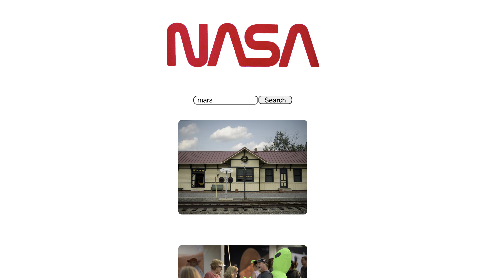
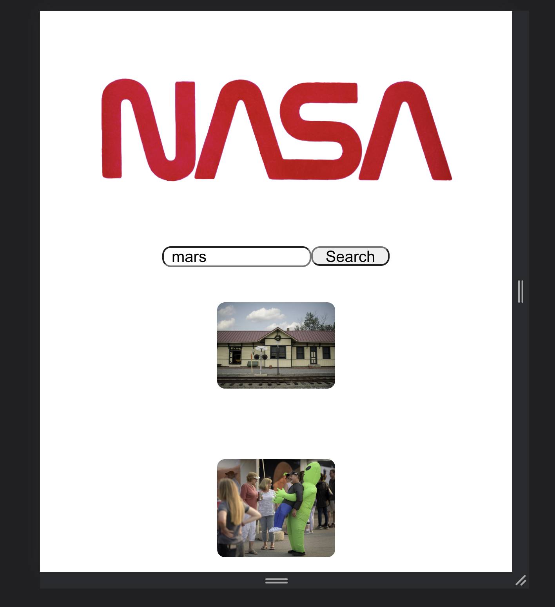

 # React Technical Test 

 This was my first practice technical test as a part of the front-end module
 at Manchester Codes. 

The brief was to build a React web application that allows users to search for images based on a query relating to space. 
I was provided with a NASA API endpoint for image search.

The following functionalities were implemented:
- A Search page which allows users to search for images by keyword
- Images returned upon a successful search

# Screenshots 

# Testing Utilities Used

- Jest 
- React Testing Library

# Packages Used 

- Axios
- PropTypes 

# Setup 

Clone This Repo - git@github.com:DanHope90/Tech_Test.git
Install Dependencies - npm install
Start the App - npm start

# What would I add to the app if I had more time ? 

If I had more time I would have worked on the styling of the app more. The functionality is there
but I think the layout could look better . 

I would change: 

- The image results to be grouped together in more of a block layout
- Change the font in the search bar and button to make to look less basic
- Create more events to the button e.g. hover 
- Style the background of the app to make it more appealing visually e.g. different colour or relate it to space

# Author

Dan Hope

